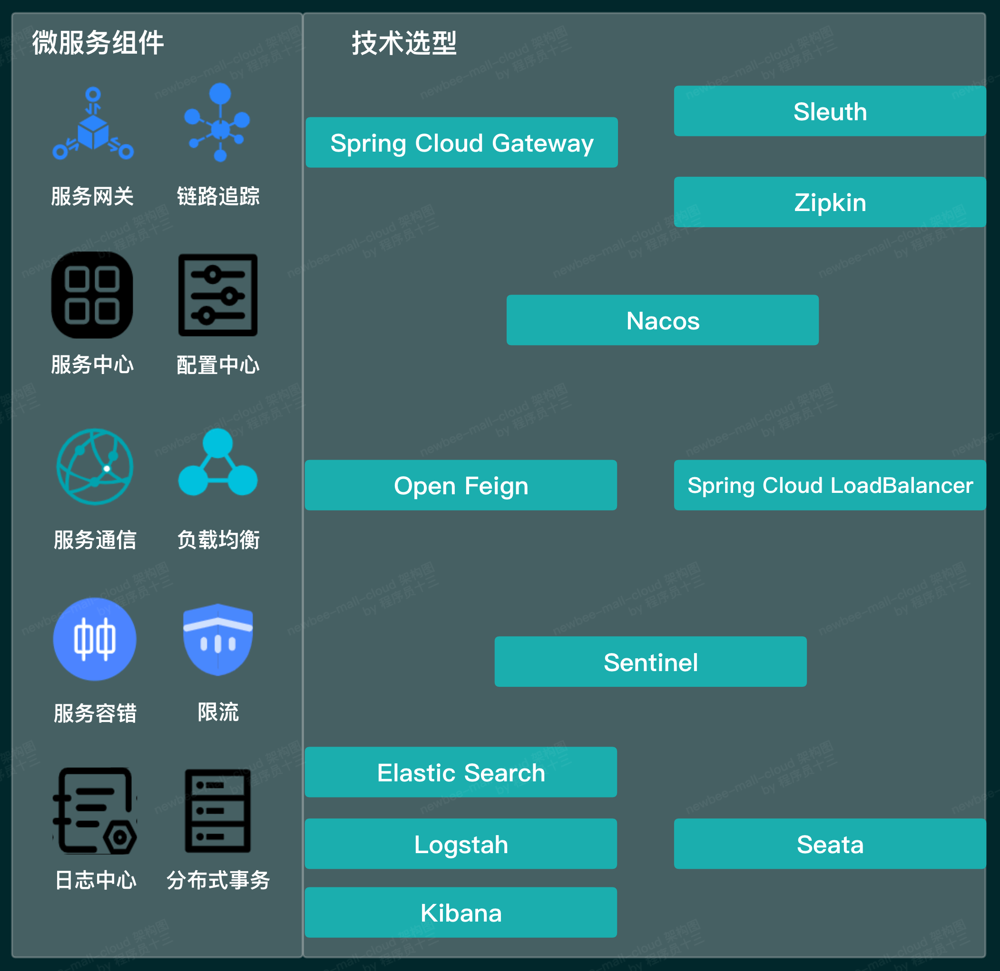
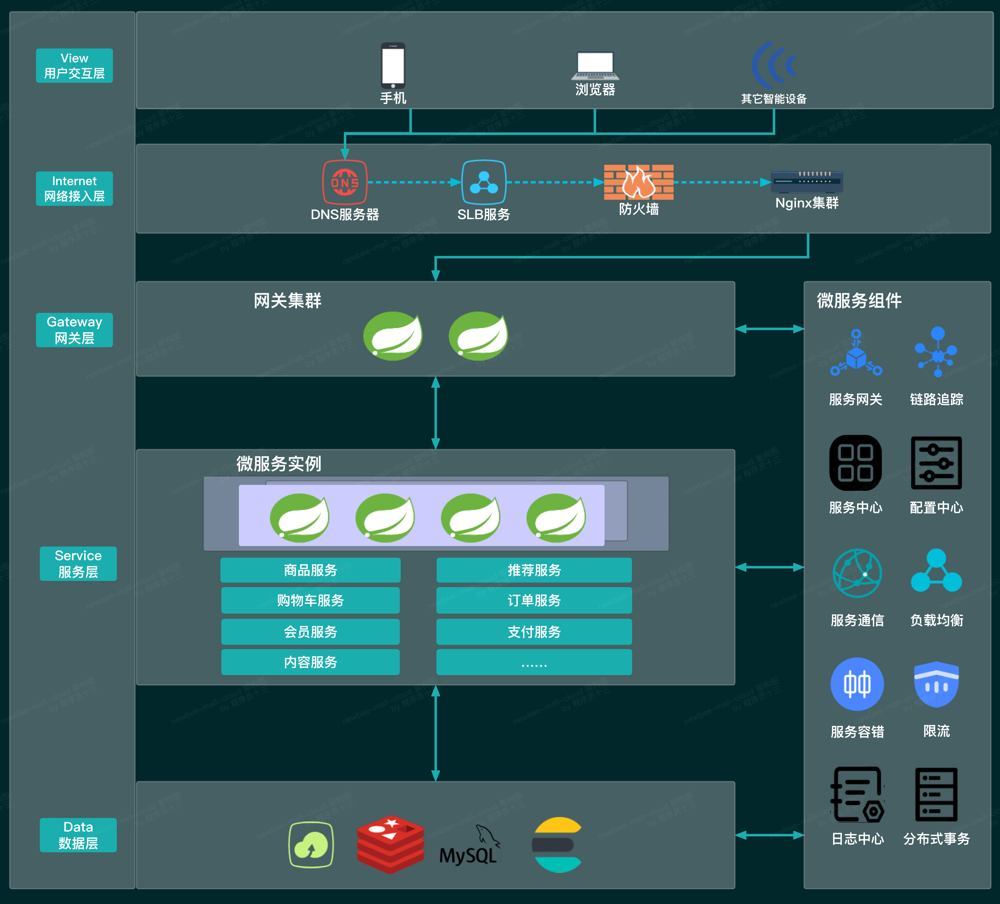

# 128MAll

## NEU

---

## Technology Selection

The development frameworks selected are as shown below.

| Development Framework | Version    |
|-----------------------|------------|
| Spring Boot           | 2.6.3      |
| Spring Cloud          | 2021.0.1   |
| Spring Cloud Alibaba  | 2021.0.1.0 |
| MyBatis               | 3.5.9      |
| Swagger               | 3.0.0      |
| Lombok                | 1.18.16    |

The microservice component technology selections are as shown below.

| Technology              | Component Implementation        |
|-------------------------|---------------------------------|
| Service Registration and Discovery | Nacos                |
| Configuration Center    | Nacos                          |
| Service Communication   | Open Feign                     |
| Load Balancer           | Spring Cloud Loadbalancer      |
| Service Gateway         | Spring Cloud Gateway           |
| Circuit Breaker         | Sentinel                       |
| Distributed Tracing     | Spring Cloud Sleuth, Zipkin    |
| Distributed Transaction | Seata                          |
| Log Center              | ElasticSearch, Logstash, Kibana |
```



## 架构图简版



- ​
